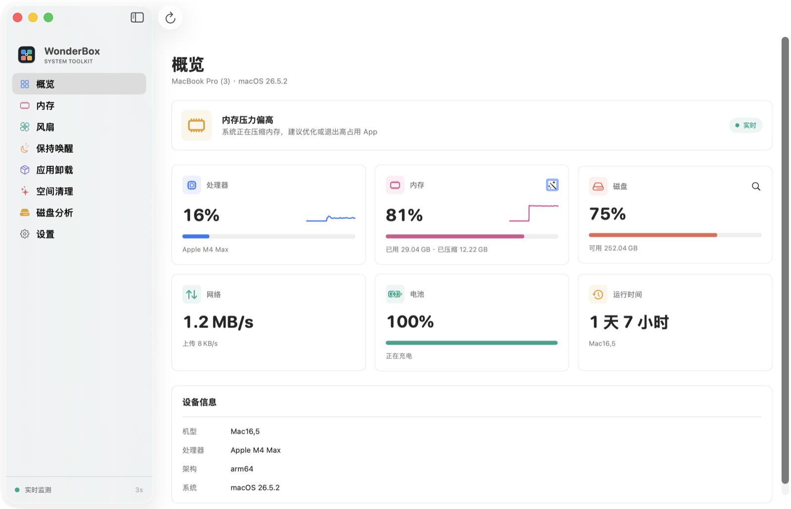
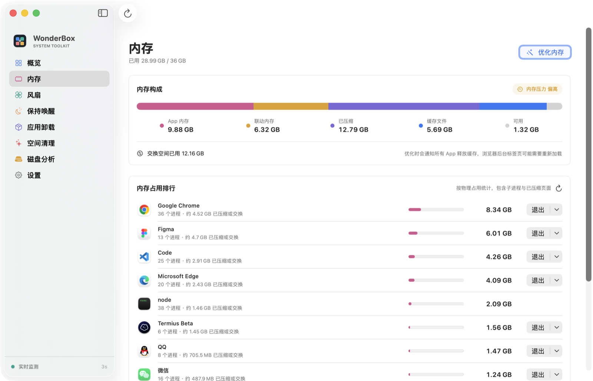
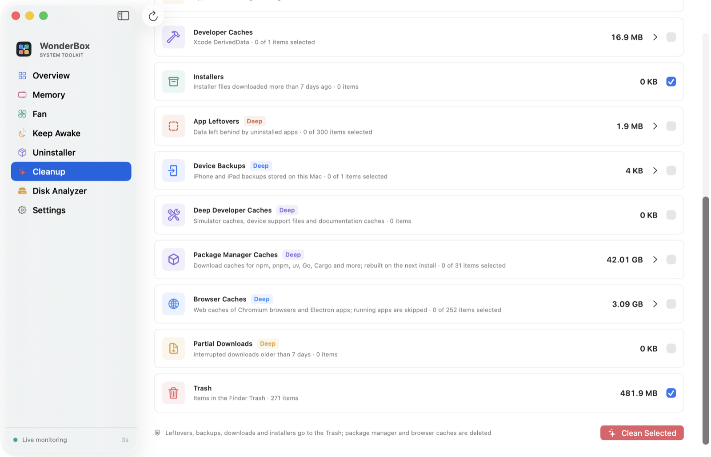
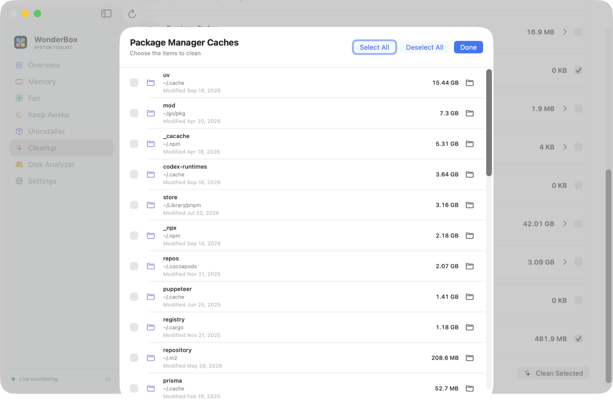
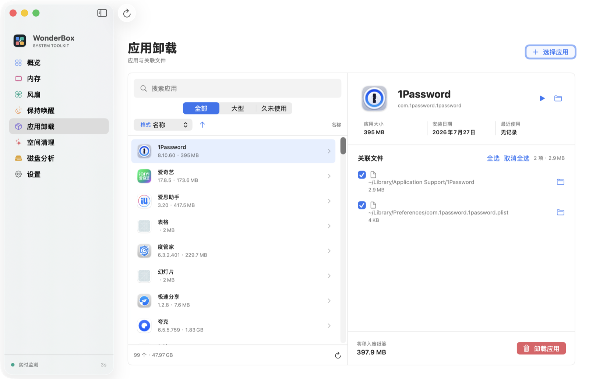
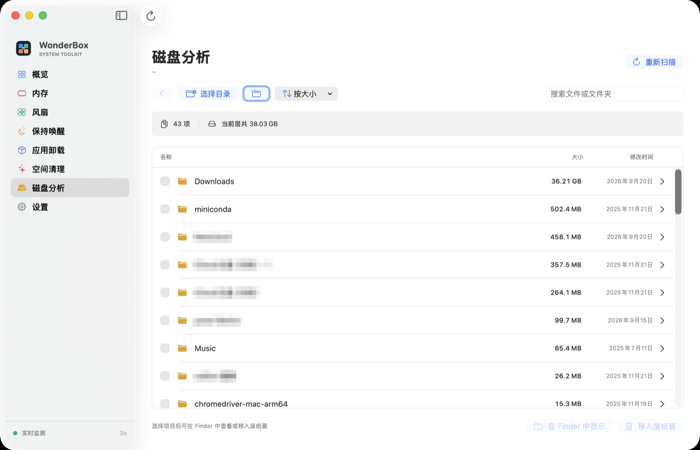
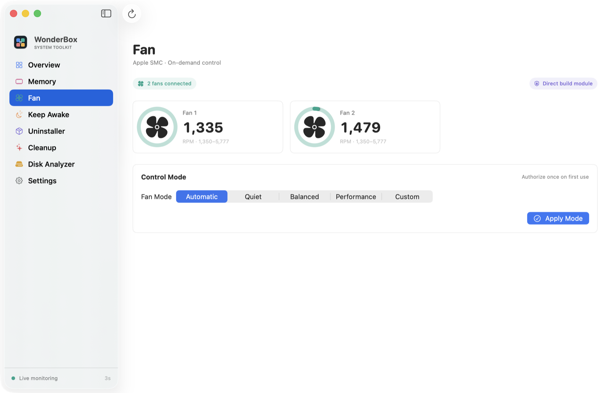
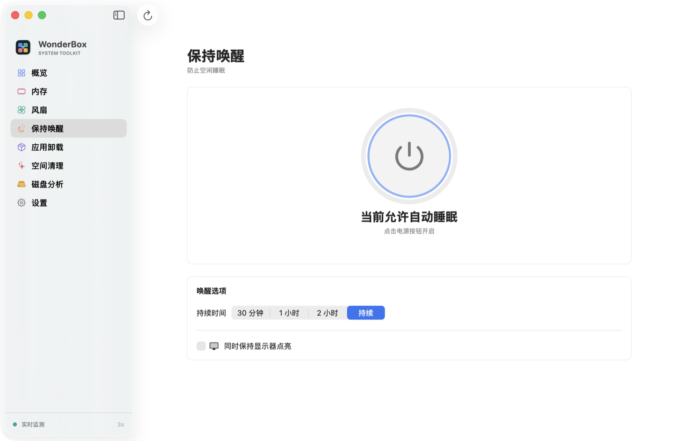
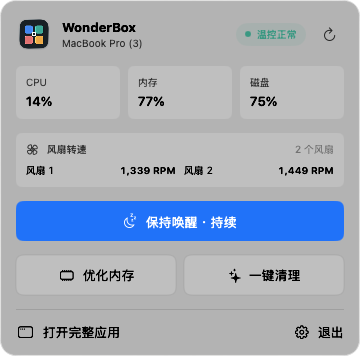
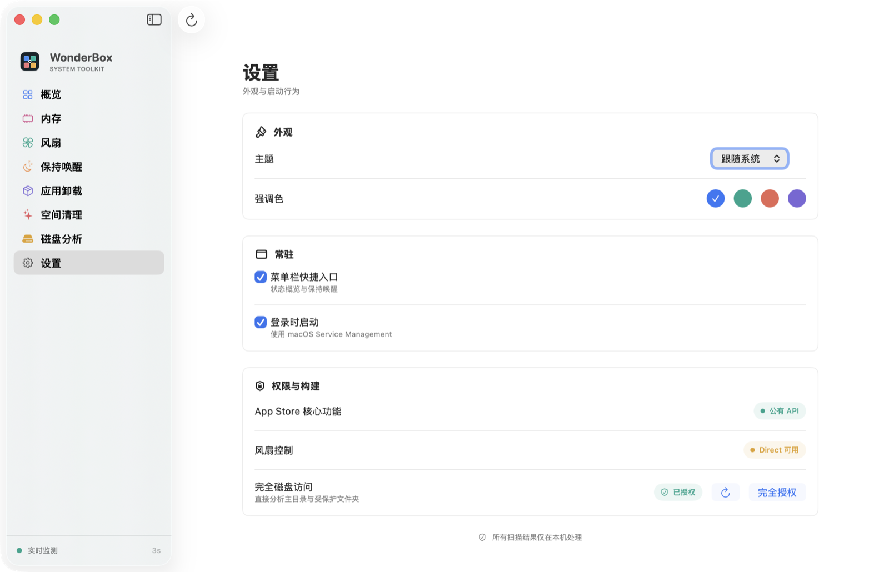

<p align="center">
  
</p>

<h1 align="center">WonderBox</h1>

<p align="center">
  A native macOS system toolkit that tells you the truth about your Mac.<br>
  Memory that actually shrinks, cleanup that finds the real space hogs, and numbers you can verify in Activity Monitor.
</p>

<p align="center">
  
  
  
  
  
</p>

<p align="center">
  English · <a href="README.zh-CN.md">简体中文</a>
</p>



> The interface is in Simplified Chinese. Everything runs on-device; nothing is uploaded.

## Why WonderBox

Most "Mac cleaners" show you a big green number and hope you don't check. WonderBox is built the other way around:

- **Memory optimization that works on compressed memory.** `purge` only drops file cache, so tools that rely on it leave the "Compressed" figure untouched. WonderBox's root helper issues the same kernel memory-pressure broadcast macOS uses, so every running app trims its caches — and the compressed pages behind them are freed too. Then it reports the before/after per category and names the apps that responded.
- **Per-app memory you can act on.** Helper processes are rolled up into their host app (Chrome's 40 renderers show as one line), with an estimate of how much of each app is sitting in the compressor or swap. Quit or force-quit from the same row.
- **Cleanup that finds the tens of gigabytes, not the megabytes.** Package-manager caches, Chromium/Electron web caches, sandboxed container caches, simulator and DeviceSupport files — the places that actually fill a developer's disk.
- **Honest numbers.** Lower bounds are shown as `≥` when a size estimate times out. Results say what changed, or say plainly that nothing did.
- **Safety by construction.** Every deletion is checked against a per-category whitelist of roots and path shapes. User data (chat databases, documents, Docker VMs, toolchains) is never a candidate. Anything that isn't a rebuildable cache goes to the Trash.

## Features

### Memory



- Activity Monitor's categories — App, Wired, Compressed, Cached Files, Available — plus swap usage and the kernel's pressure level
- Per-app physical footprint ranking with the compressed/swapped share of each app, and graceful or force quit
- One-click optimization: system-wide memory-pressure broadcast, then file-cache purge, with a per-category before/after report
- The overview health banner reflects memory pressure, not just thermal state

### Space cleanup



**Standard scan** — user caches (including sandboxed app containers), logs, Xcode DerivedData, installers older than 7 days, Trash.

**Deep scan** adds:

| Category | What it covers |
| --- | --- |
| Package-manager caches | npm, pnpm, yarn, bun, uv and other `~/.cache` tools, Cargo registry, Go modules, Gradle, Maven, CocoaPods — download caches only; toolchains and installed versions are never touched |
| Browser & Electron caches | Chromium `Cache`, `Code Cache`, `GPUCache`, Service Worker `CacheStorage` and friends inside any profile or Electron user-data folder; skipped while the owning app is running |
| Developer deep caches | Simulator caches, iOS/watchOS/tvOS DeviceSupport, documentation cache, Previews devices |
| Application leftovers | Data left behind by apps that are no longer installed (90-day cutoff, bundle-id heuristics) |
| Device backups, partial downloads | Local iPhone/iPad backups; `.download`/`.crdownload`/`.part` files older than 7 days |

Every category expands to item level so you can keep one tool's cache and drop another:



### Application uninstall



Inventory of `/Applications` and `~/Applications` with size, install date and last-use date from Spotlight; large/stale filters; related caches, preferences, containers and saved state listed per app; everything goes to the Trash.

### Disk analyzer



Drill into any folder level by level with sizes computed in parallel, sort by size/name/date, reveal in Finder or move selected items to the Trash. Cloud-synced folders are excluded from sizing so a scan never triggers downloads.

### Fan control, keep awake, menu bar

<table>
  <tr>
    <td width="50%"></td>
    <td width="50%"></td>
  </tr>
</table>



- Live fan RPM from AppleSMC; quiet/balanced/performance/custom modes on Macs that expose writable fan control (Apple Silicon `Ftst` unlock included), always revertible to automatic
- Keep-awake with a 30 min / 1 h / 2 h / indefinite timer and optional display wake, using public IOKit assertions
- Menu bar dashboard: CPU, memory, disk, fan RPM, keep-awake toggle, memory optimization and one-click cleanup without opening the window
- System / light / dark appearance, four accent colours, launch at login



## Install

Requirements: macOS 14 or newer. To build: Xcode 16 or newer.

```bash
git clone https://github.com/jasonwong1991/WonderBox.git
cd WonderBox
swift build
swift test
./scripts/package_app.sh
open build/WonderBox.app
```

The package builds `WonderBox` plus two helpers. `package_app.sh` produces a locally signed `build/WonderBox.app` with the generated icon and bundled helpers.

## Languages

WonderBox ships in English and Simplified Chinese and follows the system language; Settings › Language overrides it per app. Strings live in a single catalog, `Sources/WonderBox/Resources/Localizable.xcstrings`, with English as the source language.

To add a language:

1. Open `Localizable.xcstrings` (and `InfoPlist.xcstrings`) in Xcode's String Catalog editor, or edit the JSON directly, and add the new language code under each key's `localizations`.
2. Add the code to `LANGUAGES` in `scripts/sync_localization.py` and to the `AppLanguage` enum in `Sources/WonderBox/Core/Localization.swift` so it appears in the picker.
3. Run `scripts/sync_localization.py --check`; it fails on untranslated keys. `swift test` checks the same thing plus format-specifier consistency.

`scripts/sync_localization.py` (no flags) asks the compiler for every localizable string in source and adds new keys to the catalog, so you never hand-maintain the key list.

## Permissions

WonderBox asks for exactly what a feature needs, when you first use it:

| Feature | Permission | When |
| --- | --- | --- |
| Monitoring, keep awake, app inventory, standard cleanup | none | — |
| Trash size and emptying | Automation (Finder) | first cleanup scan |
| Full home-directory scans | Full Disk Access (optional, user-controlled) | onboarding or Settings |
| Fan control, memory optimization | Administrator password, once, to install the helper daemon | first fan write or memory optimization |
| `/Library/Caches` cleanup | Administrator password per run | when that category is selected |

The helper daemon is a fixed-command service reachable over a root-owned Unix socket. It accepts `version`, `status`, `set-auto`, `set-rpm`, and `optimize-memory` — nothing else — and is reinstalled (one prompt) only when the bundled version is newer.

## Distribution profiles

The core monitor and awake features use public APIs. Application and cleanup operations use public Foundation APIs, but broad user-Library access is restricted by App Sandbox.

- **Direct** (what `package_app.sh` builds): bundles `WonderFanHelper`; the helper daemon (protocol v4) performs fan writes and the memory-pressure broadcast/purge. Full Disk Access can be enabled once for broad local scans.
- **App Store:** enable `WonderBox-AppStore.entitlements`, omit the fan helper/CSMC source, and retain user-selected file access. Broad cleanup categories must use folder selection with security-scoped bookmarks or be disabled.

See [`docs/DISTRIBUTION.md`](docs/DISTRIBUTION.md) for the capability matrix and release checklist.

## Brand asset provenance

The WonderBox app and menu bar icons are original geometric artwork generated entirely by `scripts/generate_icon.swift` and `MenuBarAppIcon` in this repository. They do not embed third-party logos, stock artwork, or copied image assets. SF Symbols are used only as native macOS interface symbols inside the app. Application icons visible in screenshots belong to their respective owners.

## License

[MIT](LICENSE)
